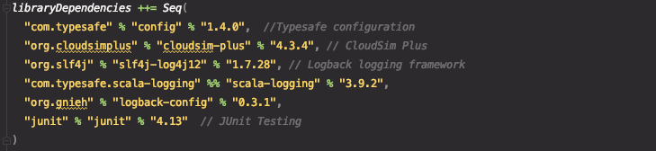

# Homework 01: Cloud simulations using CloudSim Plus

## Overview
Using [CloudSim Plus](http://cloudsimplus.org/), a simulation framework that models the cloud environments and operates different cloud models,
created cloud computing data centers and ran tasks on them. Assigned cost per resource element of each data center; costs for bandwidth usage, CPU time usage, RAM utilization, and storage.

Three data centers created with different models in place. What makes these models distinct is the virtual machine allocation policies, Cloudlet/Application scheduler policies, and Cloudlet/application resource usage policies.

Varying prices for running customers' applications. Applications length (number of code instructions) are used to determine appropriate price. 

These prices (income), along with the data center costs (outcome), are used to produce a table show a table showing total profit and profit rate for a given data center model. Ultimately, useful for brokers to simulate buying the computing time cheaply and sell it at a good markup.

## Cloud architecture and costs
### Components
Specified components and sub-components for the cloud can be found in the [config.conf](./src/main/resources/config.conf) file. 
Components such as host machines and their properties, virtual machines and their required resources. All the simulations follow these characteristics.

### Costs
Infrastructure costs given in the config file will be used for all three simulations.

## Fixed Policies And Variables
For all three models some policies and variables are constant. This is done to measure the effectiveness of more in depth policies. Too many differences will introduce much complexity and not allow for accurate analysis.   

### constants

Idle Virtual Machine Destruction Delay: 5 seconds

Datacenter Broker: Datacenter Broker Simple

Datacenter VM Allocation Policy: First Fit

## Distinct Policies In Models
The models are distinct in their pairs of virtual machine scheduler and cloudlet (application) scheduler.

### Virtual Machine Scheduler Policies
#### VMSchedulersSpaceShared
This policy allocates the required CPU (PE) from a host to a virtual machine. Virtual machines cannot share processing elements (PEs/CPUs). When there is not enough PEs in the host, allocation fails.

#### VmSchedulerTimeShared
This policy allocates the required CPU (PE) from a host to a virtual machine. Virtual machines can share processing elements (PEs/CPUs).
Each host will properly schedule processing elements for virtual machines running on that given host. Even distribution of CPU time among the virtual machines.

### Cloudlet/Application Scheduler Policies

#### CloudletSchedulerSpaceShared
It considers there will be only one Cloudlet per VM. Other Cloudlets will be on a waiting list. 
It also considers that the time to transfer Cloudlets to the Vm happens before Cloudlet starts 
executing. I.e., even though Cloudlets must wait for CPU, data transfer happens as soon as 
Cloudlets are submitted. This scheduler does not consider Cloudlet’s priorities to define an execution order.

#### CloudletSchedulerTimeShared
Cloudlets execute in time-shared manner in VM. Each VM has to have its own instance of a CloudletScheduler. This scheduler does not consider Cloudlets priorities to define execution order. If actual priorities are defined for Cloudlets, they are just ignored by the scheduler.

#### CloudletSchedulerCompletelyFair
It is a time-shared scheduler that shares CPU cores between running applications by preempting them after a time period (time-slice) to allow other ones to start executing during their time-slices.
More CPU time will be distributed to Cloudlets/Application with higher priority. Priority of a Cloudlet/Application will be determined by the length of the cloud (meaning number of code instructions).

##### Model One: VmSchedulerSpaceShared And CloudletSchedulerSpaceShared
##### Model Two: VmSchedulerTimeShared And CloudletSchedulerTimeShared
##### Model Three: VmSchedulerTimeShared And CloudletSchedulerCompletelyFair

## Outcome
With multiple runs a clear model was the winner and produce higher profit rates than the other models. This model was Model Three, due to its resource sharing nature. Cloudlets were able to fully utilize all resources available.

## Dependencies

