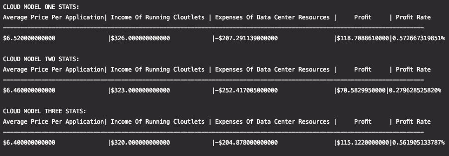
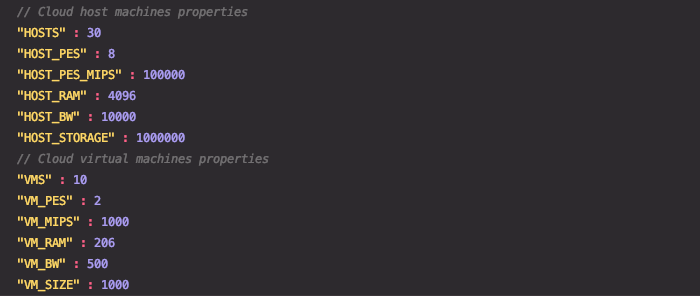
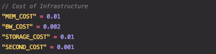

# Homework 01: Cloud simulations using CloudSim Plus

## Overview
Using [CloudSim Plus](http://cloudsimplus.org/), a simulation framework that models the cloud environments and operates different cloud models,
created cloud computing data centers and ran tasks on them. Assigned cost per resource element of each data center; costs for bandwidth usage, CPU time usage, RAM utilization, and storage.

Three data centers created with different models in place. What makes these models distinct is the virtual machine allocation policies, Cloudlet/Application scheduler policies, and Cloudlet/application resource usage policies.

Varying prices for running customers' applications. Applications length (number of code instructions) are used to determine appropriate price. 

These prices (income), along with the data center costs (outcome), are used to produce a table show a table showing total profit and profit rate for a given data center model. Ultimately, useful for brokers to simulate buying the computing time cheaply and sell it at a good markup.

## Cloud architecture and costs
### Components
Specified components and sub-components for the cloud can be found in the [config.conf](./src/main/resources/config.conf) file. 
Components such as host machines and their properties, virtual machines and their required resources. All the simulations follow these characteristics.

### Costs
Infrastructure costs given in the config file will be used for all three simulations.

# Dependencies
